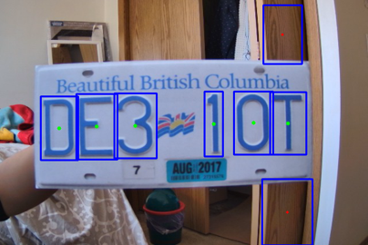

# SmartMetr License Plate Detection 🚘
## Summary
License plate detection using:
- OpenCV for identifying and isolating letters in the image.
- A classification neural network for letter categorization, which was trained using the [Emnist](https://www.nist.gov/itl/products-and-services/emnist-dataset) dataset with custom entries cropped from license plate photos. 

This code runs on the DE1-SoC Ubuntu Distribution for our CPEN 391 project.

## Process
### 1️⃣ Photo Taken

### 2️⃣ OpenCV Code Finds Letters
- Marked by the rectangles with green dots.

### 3️⃣ Neural Network Classifies Letters

## Program Loop Overview
- Every few seconds, it launches the camera.
  -The camera finds when the frames are constant enough to take a photo.
  - It will try to detect the edge of the plate, but will settle for the full image if it can’t find it.
- It converts photo to HSV to use colour profile to find letter shapes.

- It extracts letters and uses custom-trained neural network to find what the character detected is.
- It writes the result to log file.

# Running Instructions
Run the following commands to install needed packages:
- For base requirements:
    - `pip install -r requirements/requirements.txt`
- To run neural network on python layer - OPTIONAL:
    - `pip install -r requirements/requirements_for_tensorflow.txt` 

To run the code to detect using the camera every few seconds, use:
- `python recognize.py`

If you have a pre-taken photo for detection, use:
- `python recognize.py <path/to/file>`

NOTE: the `sudo` keyword is needed in Linux if using the hardware-accelerated neural network (if `constants.USE_C == True`)

